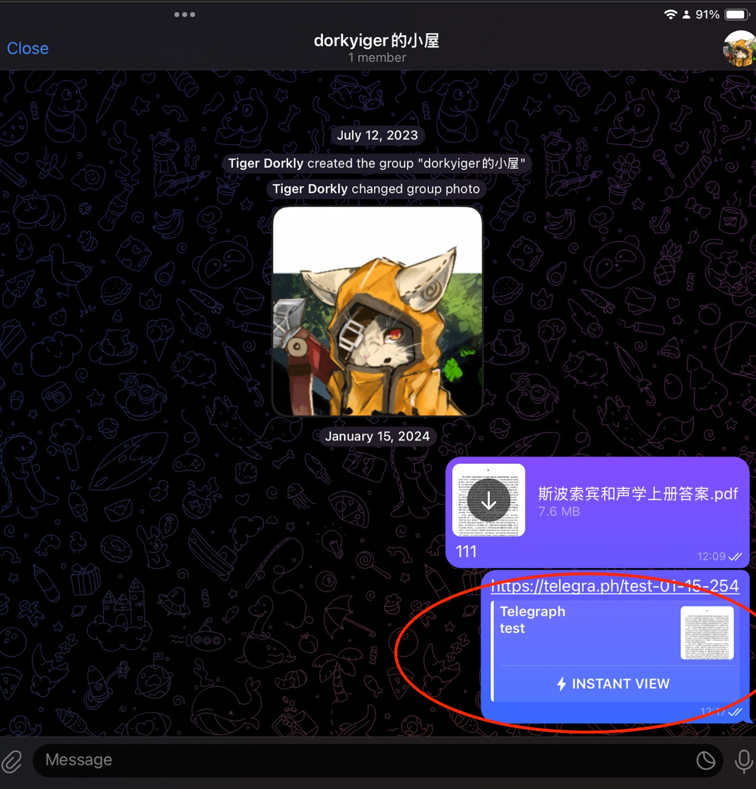
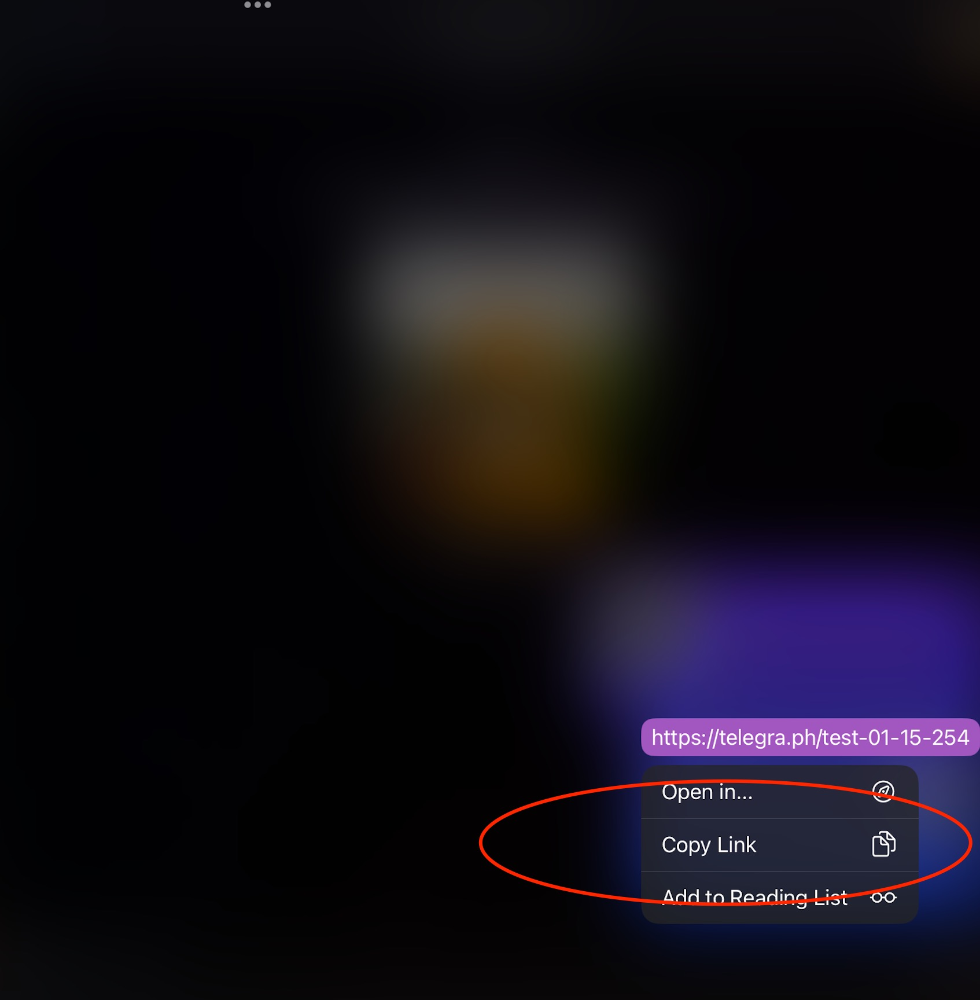
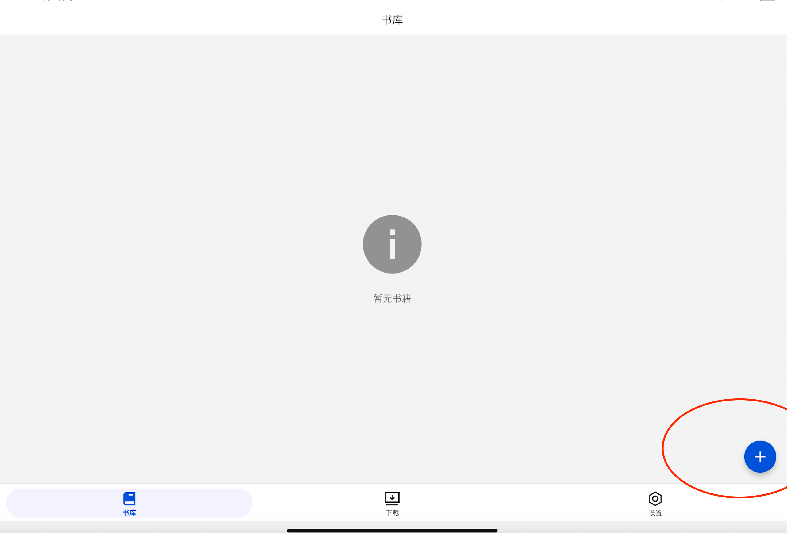
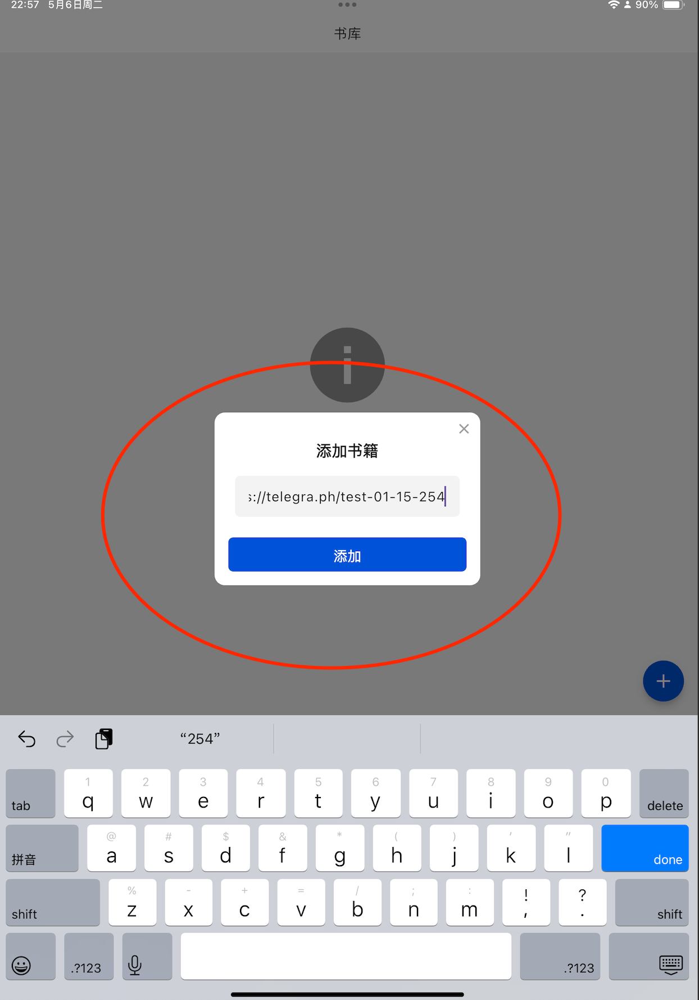
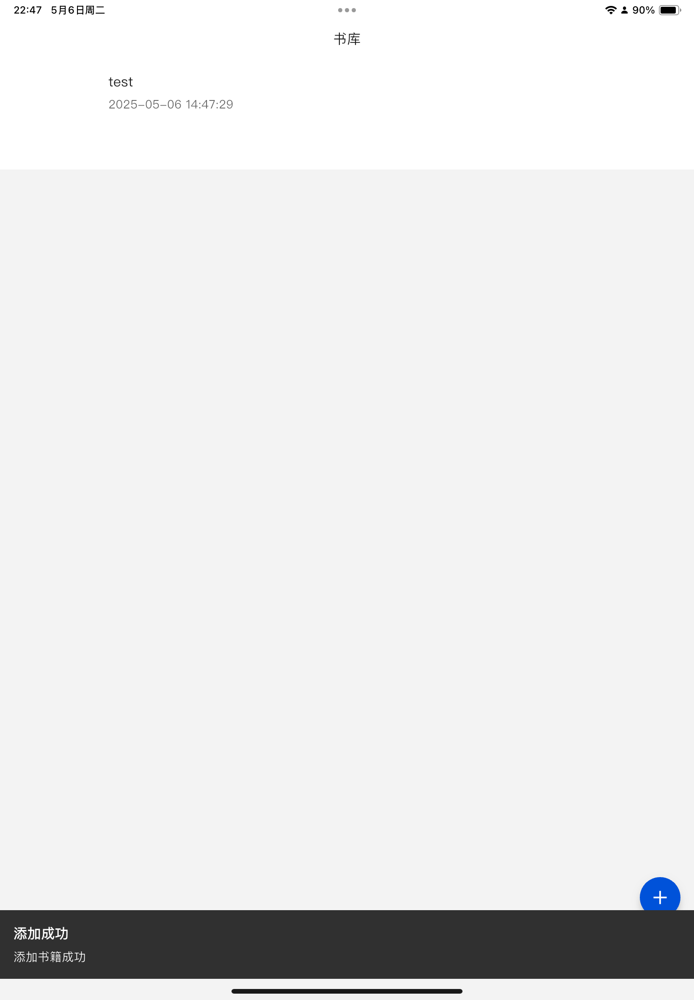
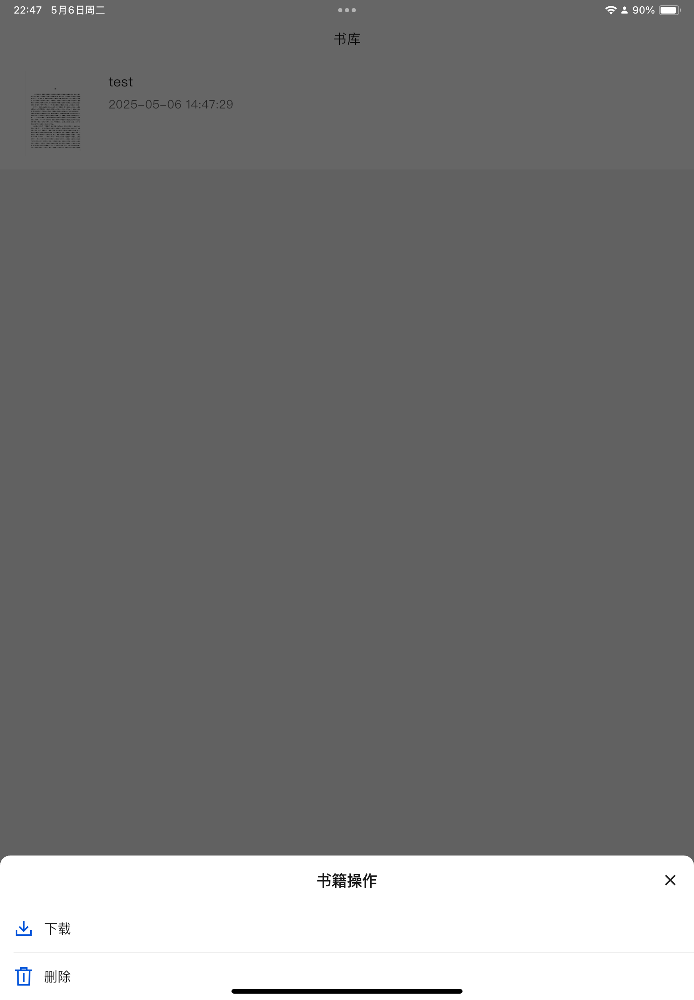
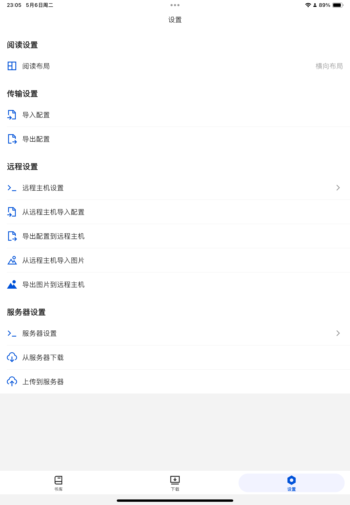

# TeleBook：一个专门用来下载telegraph上预览书籍的app

**TeleBook**是一个用**flutter**书写，专门用来下载telegraph上预览书籍的app，只需简单拷贝其链接并点击下载，即可解析其网页所在的全部
**img**，还包含了通过SSH或者服务器端上传本地书籍和下载书籍的功能，可以实现**实现多端同步**

# 下载安装

可以下载已经编译的版本，也可以收到下载编译安装

1. github上下载：[release](https://github.com/dorkytiger/TeleBook/releases)
2. 手动编译安装：克隆下来后，执行`flutter build apk`或者`flutter build ios`，然后安装到手机上，需要有flutter环境

# 快速开始

1. 打开某蓝色软件，选择你要下载**telegraph**的书籍

2. 复制其地址

3. 打开**TeleBook**，点击右下角的➕号

4. 在弹出的窗口中粘贴刚刚复制的链接，点击添加

5. 解析成功🎉

6. 长按即可下载到本地

# 关于同步备份、远程服务器

- **传输设置**

可以导出当前设备的书库信息的`json`文件，然后其他设备导入同步书库信息，可以选择跳过重复链接，不然相同的书籍会重复导入

- **远程设置**

远程设置用的`ssh`作为链接，可以把当前设备的书库信息和图片同步到本地或远程的电脑

- **服务器设置**

`go`写的小型服务端，部署到本地或远程的服务器，填写好地址和端口号，即可上传或下载书库信息和图片